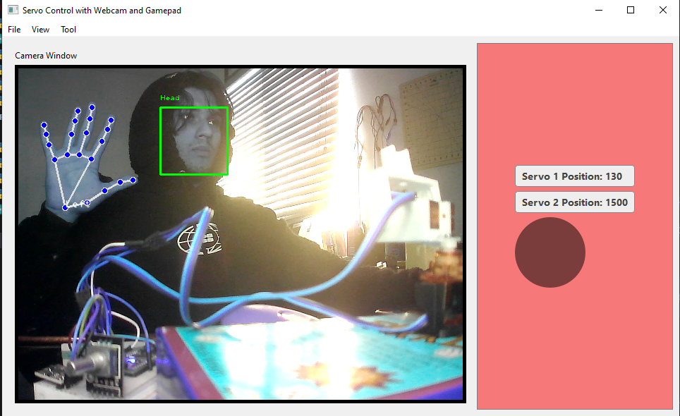

# Servo Controller with Live Webcam -Kepler22b

## Aman Adhikari

## WHAT IT DOES
-------------
<ol>
  <li>Controller for 'X' & 'Y' servos</li>
  <li>Live Camera View and Image capture</li>
  <li>OpenCV image processing and tracking</li>
</ol>

*OPEN CV- HAND & FACE TRACKING EXAMPLE*

## Current Implementations
* # PySide6

*  Current Directory 
*  Dark Mode for Nightsky viewing
* Tools menu bar (calibration, camera controlls, etc) 

# How it works

* Serial Monitor with Microcontroller(Arduino Nano in my example)

*embedded arduino code*

**PythonScript to communicate with microcontroller**

